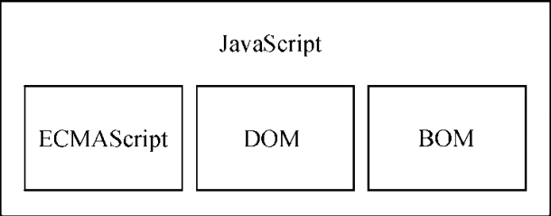
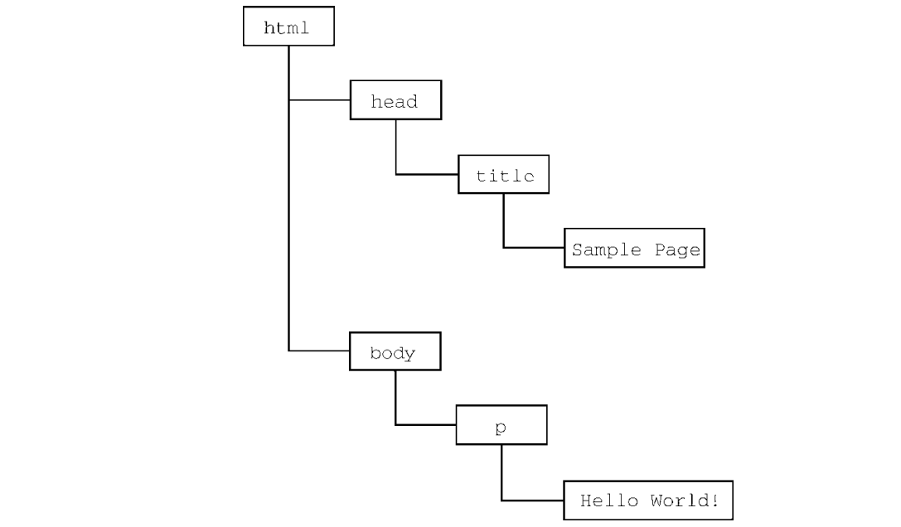

# 什么是JavaScript


## 1.历史回顾

1995年，网景公司的工程师Brendan Eich开发了一个叫Mocha的脚本语言，主要用于客户端处理简单的数据验证。发布前夕，为了搭上热点临时改名JavaScript。

在网景公司发展JavaScript的同时，微软也在在家的IE3中实现了JavaScript（名为JScript）。

两个巨头的对抗使得JavaScript的发展两级分化，语法和特性无法统一。终于在1997年，JavaScript1.1被提交到欧洲计算机制造商协会(Ecma)的第39技术委员会（TC39），目的在于将JavaScript标准化为一门通用、跨平台、厂商中立的脚本语言。最终，TC39委员会打造了**ECMAScript脚本语言标准**。各大浏览器厂商也都已ECMAScript作为自己JavaScript实现的依据。


## 2.JavaScript实现

尽管ECMAScript是语言标准，但我们可能更习惯说JavaScript。那么JavaScript和ECMAScript是什么关系呢？

> ECMAScript是JavaScript的规格，JavaScript是ECMAScript的实现。

完整的JavaScript包含以下3个部分：

+ 核心（ECMScript）
+ 文档对象模型（DOM）
+ 浏览器对象模型（BOM）




### ECMAScript

ECMAScript，定义了这门脚本语言的基准；该语言也不局限于浏览器，Web浏览器仅仅是ECMAScript实现的一种宿主环境，服务器端Node.js也实现了宿主环境。

ECMA262(ECMAScript)主要描述或定义了以下部分：

+ 语法
+ 类型
+ 语句
+ 关键字
+ 保留字
+ 操作符
+ 全局对象

#### ECMAScript版本

ECMAScript（以下简称ES）第三版增加了许多东西，标志着ECMAScript成为一门真正的编程语言。

ES4对该语言进行了彻底修订，但是很可惜在发布前夕被放弃。

ES5于2009年发布，是目前主流浏览器兼容性最好的一个版本。

ES6于2015年发布，正式支持类，模块，迭代器，生成器，箭头函数等，

...

ES10，也称ES2019，发布于2019年6月。

#### 浏览器对ECMAScript的支持

2008年，五大浏览器（IE、Firefox、Safari、Chrome和Opera）全部兼容ECMA第三版，IE8部分支持ECMA第5版，IE9完全支持。

至于ECMA第6版，则在微软新的浏览器Edge中得到了支持，目前主流的浏览器均支持ECMA第6版，即使不支持的浏览器也可以通过Babel转换来实现兼容。


### DOM

DOM,即Document Object Model,译为文档对象模型，是一个应用编程接口（API）。

DOM将整个HTML页面抽象成一组分层节点，HTML的每个标签都是节点，包含不同的数据。

例如下面的HTML页面：

```html
<html>
    <head>
        <title>Sample Page</title>
    </head>
    <body>
        <p>Hello,World.</p>
    </body>
</html>
```

上述代码通过DOM可以表示为一组分层节点，如下



转换成DOM后，开发者可以通过DOM提供的API轻松增加、删除、替换和修改节点，达到随心所欲控制网页的内容和结构。

最关键的是，DOM是人们制定的标准，所有浏览器厂商如果希望得到更多开发者的支持，就必须遵守标准。

#### DOM级别

+ DOM Level1 规范由两个模块组成：DOM Core和DOM HTML。对于网页开发者而言，DOM HTML在DOM Core 映射XML文档的基础上增加了基于HTML的对象和方法，更方便访问和操作文档。

+ DOM2新增了DOM视图、DOM事件、DOM样式和DOM遍历与范围等功能。
+ DOM3进一步扩展了DOM，增加了DOM Load and Save模块。
+ DOM Level 0并不是标签，知识DOM历史中的参考点，可以看做IE4时代最初支持的DHTML。


#### 其他DOM

有些其他语言也发布了自己的DOM标准，例如：

+ 可伸缩矢量图 SVG
+ 数学标记语言 MathML
+ 同步多媒体集成语言 SMIL


#### Web浏览器对DOM支持情况

| 浏览器  | DOM兼容              |
| ------- | -------------------- |
| IE5.5~8 | Level 1              |
| IE9+    | Level1 Level2 Level3 |
| Edge    | Level1 Level2 Level3 |

其他主流浏览器对DOM兼容性要好很多，例如Chrome1+就部分支持Level2，目前最新的Chrome88则完全支持Level3。


### BOM


